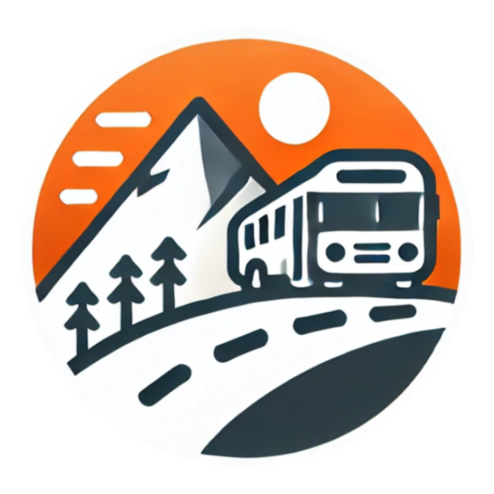

<h1 align="center">
  <br>
    
  <br>
    Rocky Top Transit Link
  <br>
</h1>

### Names/Github ids ###
- Anant Jeet Sahoo: anantsahoo
- Harrison Crettol: harrisoncrettol
- Deep Patel: Deep0320
- William Douglass: williamdouglass078


## Overview

We're building a bus route planning web application using Flask. Users can view a map, plan trips, and save favorite locations.

## Setup and Installation

-  Please carefully follow all the steps listed below in order.

### Prerequisites

- Python 3.12.6 (Preferably Virtual Environment)
- pip (Python package installer)
- C++ Build Tools (install instructions listed below)
- Internet connection

## Before anything install C++ Build Tools

1. Go here: https://visualstudio.microsoft.com/visual-cpp-build-tools/
2. Click "Download Build Tools"
3. Open the installer.
4. Under the "Workloads" section, select "Desktop development with C++"
5. Click "Install"
6. Restart computer to apply changes.

## How to Build and Run the Project

1. **Clone the Repository**
   ```bash
   git clone https://github.com/utk-cs340-fall24/RockyTop-Transit-Link.git

2. **Go to Project Directory**
   ```bash
   cd FinalProj

3. **Install Requirements**

   ```bash
   pip install -r requirements.txt

4. **Initialize Database**
   ```bash
   flask db init

5. **Migrate Database**
   ```bash
   flask db migrate

6. **Upgrade Database**
   ```bash
   flask db upgrade

7. **Run the Application**
   ```bash
   flask run

8. **Access the Application**

      Open your web browser and navigate to http://localhost:5000/


## How to Use the Project

1. **Finding a Route**
- Enter a starting and ending location, which can be the name of a bus stop or any full address, then click "Find Route".
- You can also specify the departure time to calculate future routes.
2. **Register/Login**
- First register an account by clicking "Register Account".
- Then you can login by clicking "Login".
- This gives you access to History, Favorites, and Settings.
3. **History**
- You can see routes you've found by clicking "History" in the navbar.
4. **Favorites**
- To add a favorite location, click the "Favorites", enter a bus stop name or full address, then click add.
- IMPORTANT: You must refresh the page for the favorites to show up on the map page.
- You can then click the favorite location on the map page and it will fill in the starting/ending location. 
5. **Settings**
- You can change your password or delete your account.

## Additional Notes
Credits: GTFS data downloaded from https://www.knoxvilletn.gov/cms/One.aspx?portalId=109562&pageId=11688599


## License
This project is licensed under the MIT License - see the [LICENSE.txt](LICENSE.txt) file for details.